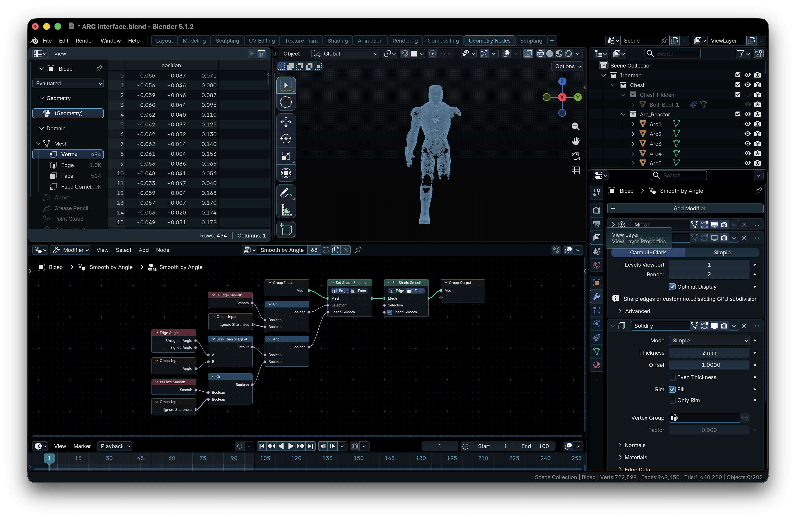
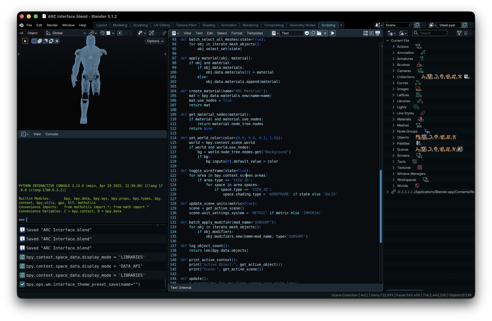

# Blender ARC Interface

ARC Interface is a Blender theme that transforms the UI into a cohesive blue, holographic-style workspace focused on immersion, comfort, and clean visual hierarchy.

# ARC Interface

Blender theme with a cohesive blue holographic-inspired UI designed for immersion, visual clarity, and comfortable long-session use.

---

## Overview

ARC Interface replaces Blender’s default theme colors with a unified blue-tinted palette that reshapes the entire application interface. Every editor has been adjusted through Blender’s Theme Preferences system to create a consistent visual language across all workflows.

The goal is to refine how Blender feels to use by reducing visual noise, improving focus, and creating a more immersive workspace.

This is an official [Blender Extension](https://extensions.blender.org/themes/arc-interface/)

---

## Features

* Fully recolored Blender interface using Theme Preferences
* Cohesive blue-based visual system across all editors
* Improved visual hierarchy for interface elements
* Reduced visual fatigue during long sessions
* Subtle gradients for enhanced depth and interaction feedback
* Consistent styling across all workspaces and modes
* Designed for immersion without sacrificing usability

---

## Visual Style

ARC Interface is built around a unified holographic-inspired aesthetic:

* Dominant blue tones throughout the interface
* Soft contrast between panels and active elements
* Smooth gradients instead of harsh separation
* Clear separation of important UI elements without distraction
* Subtle feedback on interactive controls (buttons, toggles, sliders)

The result is an interface that feels cohesive and responsive while remaining practical for production use.

---

## Screenshots

### Full Interface Overview  
*A complete command view of your workspace - A unified control center for creation.*

---

### 3D Viewport  
*Build, shape, and iterate the future inside a focused spatial workspace where the interface wraps around your latest invention.*

---

### Shader / Node Editor  
*Design materials as if you are routing systems in a live control network — precise, structured, and visually clear.*

---

### Properties Panel Close-up  
*Every adjustment at your fingertips — tuned for fast iteration and deliberate control over your scene.*

---

### Animation  
*Create through time with a workspace built with a focus for timing, motion, and intentional control — frame by frame clarity.*

---

### Geometry Nodes  
*Construct procedural systems like an engineering master — structured, readable, and powerful at scale.*

---

### Scripting  
*The heartbeat of the modern world - wield the power of code-modeling with style.*

---

### Compositing  
*Finalize your work in a controlled environment designed for clarity, balance, and precise visual output.*

---

## Installation

### Straight from Blender
1. Go to **Edit → Preferences → Get Extensions**
2. Change **Add-ons → Themes**
3. Search for **"ARC Interface"** and install

### From this page
1. Download the theme file (`ARC_Interface.xml` or packaged extension file)
2. Open Blender
3. Go to **Edit → Preferences → Themes**
4. Click **Install…**
5. Select the theme file
6. Enable ARC Interface

---

## Compatibility

* Blender 4.2+
* Designed for modern Blender UI layouts
* Works across all major editors and workspaces

---

## Notes

This theme focuses on visual consistency rather than workflow modification. It does not change Blender functionality, only appearance.

---

## Release Notes

See release notes in the repository for version history and updates.

---

## License

Distributed under GPL-3.0-or-later.

---

## Credits

Designed and configured manually using Blender Theme Preferences.

Copyright (C) 2026 The Iron Maker.
ARC Interface is free software: you can redistribute it and/or modify it under the terms of the GNU General Public License as published by the Free Software Foundation...